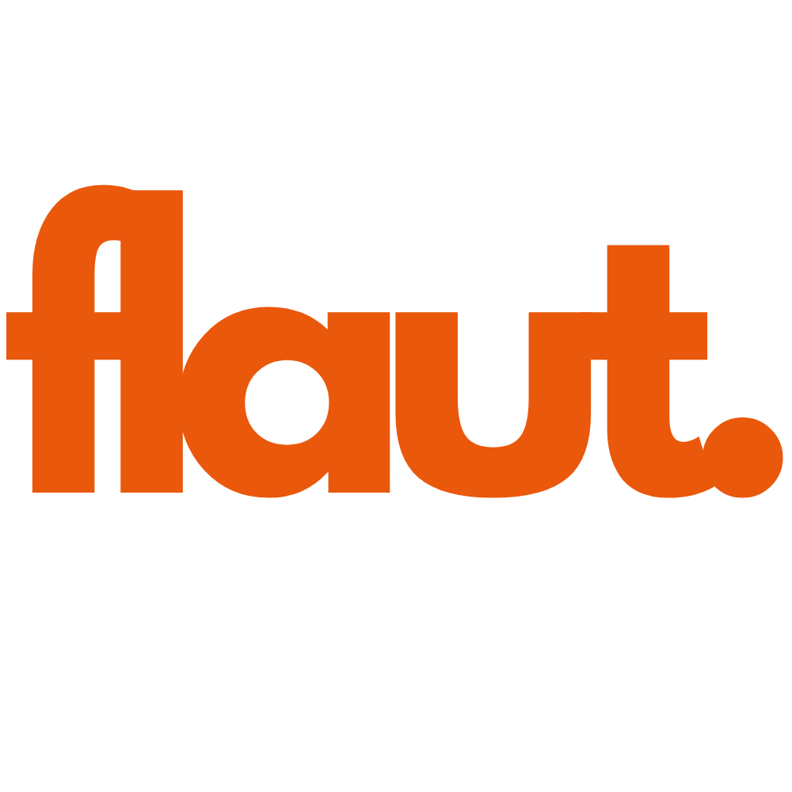

## About Flaut

Flaut is an e-commerce platform dedicated to selling fashion products. Built with Laravel and TailwindCSS, Flaut aims to provide a seamless and enjoyable shopping experience. The project is currently under development, with exciting features to come, including:

- User authentication and profile management.
- Product catalog with advanced filtering and search.
- Shopping cart and checkout process.
- Order management and tracking.
- Integration with payment gateways.
- Responsive design for mobile and desktop.

## Contributing

Thank you for considering contributing to the Flaut project! The contribution guide can be found in the [Laravel documentation](https://laravel.com/docs/contributions).

## Code of Conduct

In order to ensure that the Flaut community is welcoming to all, please review and abide by the [Code of Conduct](https://laravel.com/docs/contributions#code-of-conduct).

## Security Vulnerabilities

If you discover a security vulnerability within Flaut, please send an e-mail to the development team via [security@flaut.com](mailto:security@flaut.com). All security vulnerabilities will be promptly addressed.

## License

The Flaut project is open-sourced software licensed under the [MIT license](https://opensource.org/licenses/MIT).
